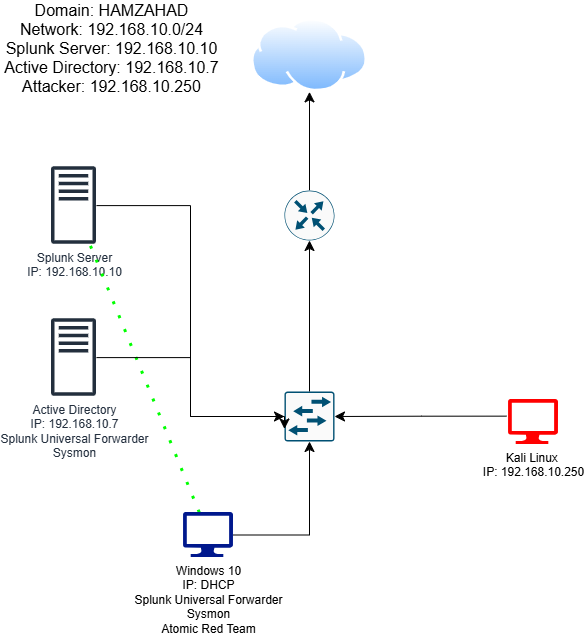

# Active Directory SOC Lab

A hands-on cybersecurity lab focused on Active Directory, Windows security monitoring, SIEM analysis, endpoint telemetry, attack simulation, and detection engineering.

## Overview

This project documents the development of a controlled Active Directory environment designed to simulate security monitoring within a small enterprise network.

The environment was used to practice Active Directory administration, Windows event monitoring, endpoint telemetry collection, SIEM investigation, controlled attack simulation, and security detection.

## Objectives

- Build and configure an Active Directory environment
- Configure Windows endpoints within the domain
- Deploy Sysmon for enhanced endpoint telemetry
- Collect and analyse Windows security events
- Configure Splunk for SIEM monitoring
- Generate controlled attack activity
- Investigate authentication and process activity
- Develop detection logic for suspicious behaviour
- Apply MITRE ATT&CK concepts where applicable

## Architecture

## Technologies

| Technology | Purpose |
|---|---|
| Active Directory | Identity and domain management |
| Windows Server 2022 | Domain Controller |
| Windows 10 Pro | Endpoint environment |
| Splunk | SIEM and security log analysis |
| Sysmon | Endpoint telemetry |
| Kali Linux | Security testing and attack simulation |

## Lab Setup

The lab consists of an isolated virtualised environment containing the Windows infrastructure, Active Directory domain, security monitoring components, and attack simulation system.

See [Lab Setup](documentation/lab-setup.md) for details.

## Active Directory

Active Directory was configured to provide centralised identity and domain management within the lab.

This included configuring the domain environment, users, groups, and domain-joined systems.

See [Active Directory Configuration](documentation/active-directory.md).

## Security Monitoring

Windows security telemetry and Sysmon events were collected and analysed using Splunk.

Monitoring focused on authentication activity, process execution, and suspicious endpoint behaviour.

See [Splunk Monitoring](documentation/splunk.md) and [Sysmon](documentation/sysmon.md).

## Attack Simulation

Controlled security testing was performed within the isolated environment to generate realistic security telemetry.

The resulting events were investigated in Splunk to evaluate whether suspicious activity could be identified.

See [Attack Simulation](documentation/attack-simulation.md).

## Detection & Investigation

The project focused on identifying suspicious activity through security event analysis.

Examples include:

- Failed authentication attempts
- Successful authentication activity
- New account creation

Detailed detection examples are documented in the [detections](detections/) directory.

## Key Skills Demonstrated

- Active Directory
- Windows Security
- Splunk
- Sysmon
- SIEM Analysis
- Log Analysis
- Authentication Investigation
- Endpoint Monitoring
- Attack Simulation
- Detection Engineering
- MITRE ATT&CK
- Incident Investigation
