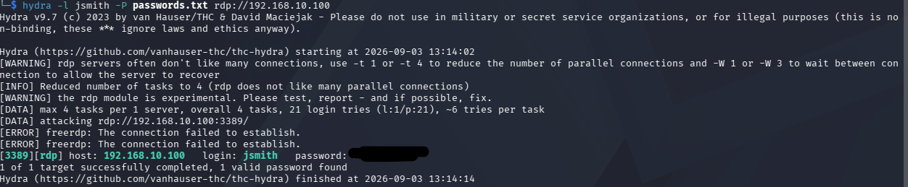
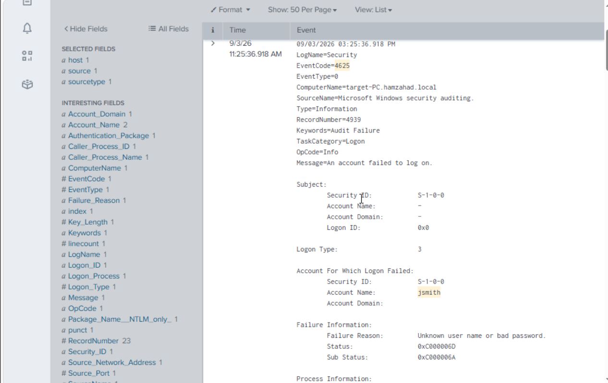

# Attack Detection

## Objective

Validate whether controlled attack activity generated observable security telemetry that could be identified and investigated through SIEM analysis.

## Attack Activity

A controlled brute-force attack was performed against the lab environment's Remote Desktop Protocol (RDP) service. Repeated password attempts were used to generate failed authentication events for analysis.

## Telemetry Generated

The repeated authentication attempts generated Windows Security Event ID 4625 events, representing failed logon attempts. The resulting telemetry was collected and analysed in Splunk.

## Detection

The resulting Windows security events were searched and filtered within Splunk to identify repeated failed authentication attempts associated with the simulated RDP brute-force activity.

## MITRE ATT&CK Mapping

| Item | Mapping |
|---|---|
| Tactic | Credential Access |
| Technique | T1110 – Brute Force |
| Sub-technique | T1110.001 – Password Guessing |
| Targeted Service | T1021.001 – Remote Services: Remote Desktop Protocol |
| Telemetry | Windows Security Event ID 4625 |

The simulated attack involved repeated password attempts against an RDP service. Failed authentication attempts generated Windows Event ID 4625 events, which were collected and analysed in Splunk.

## Investigation

The investigation considered:

- Event timestamps
- Source system
- Target system
- User account
- Logon information
- Related security events
- Number and frequency of failed authentication attempts

The repeated failed authentication events provided evidence of the simulated password-guessing activity.

## Result

The exercise demonstrated the complete security monitoring workflow:

**Attack Activity → Windows Security Telemetry → SIEM Ingestion → Detection → Investigation**
