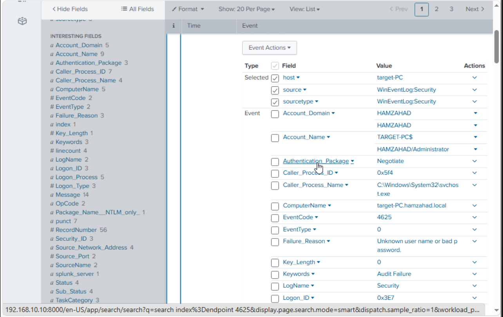

# Authentication Detection

## Objective

Detect repeated failed authentication attempts that may indicate password guessing, brute-force activity, or other suspicious authentication behaviour.

## Relevant Event

Windows Event ID 4625 was used to identify failed logon attempts.

## Detection Logic

The detection searches for failed authentication events and identifies repeated attempts involving the same account, source, or host.

## MITRE ATT&CK Mapping

| Item | Mapping |
|---|---|
| Tactic | Credential Access |
| Technique | T1110 – Brute Force |
| Sub-technique | T1110.001 – Password Guessing |
| Targeted Service | T1021.001 – Remote Services: Remote Desktop Protocol |
| Windows Event | 4625 – An account failed to log on |

The simulated activity involved repeated password attempts against an RDP service. Windows Event ID 4625 was used as the primary telemetry source for identifying failed authentication attempts.

## Investigation

When investigating an alert, the following information should be reviewed:

- Username
- Source network address
- Destination computer
- Logon type
- Failure reason
- Timestamp
- Number of attempts

## Evidence

## Analyst Interpretation

A single failed authentication attempt may be benign. Multiple failures within a short period may warrant further investigation, particularly when they originate from the same source or target the same account.

## Outcome

This detection demonstrates how Windows authentication telemetry can be used to identify potentially suspicious login behaviour.
