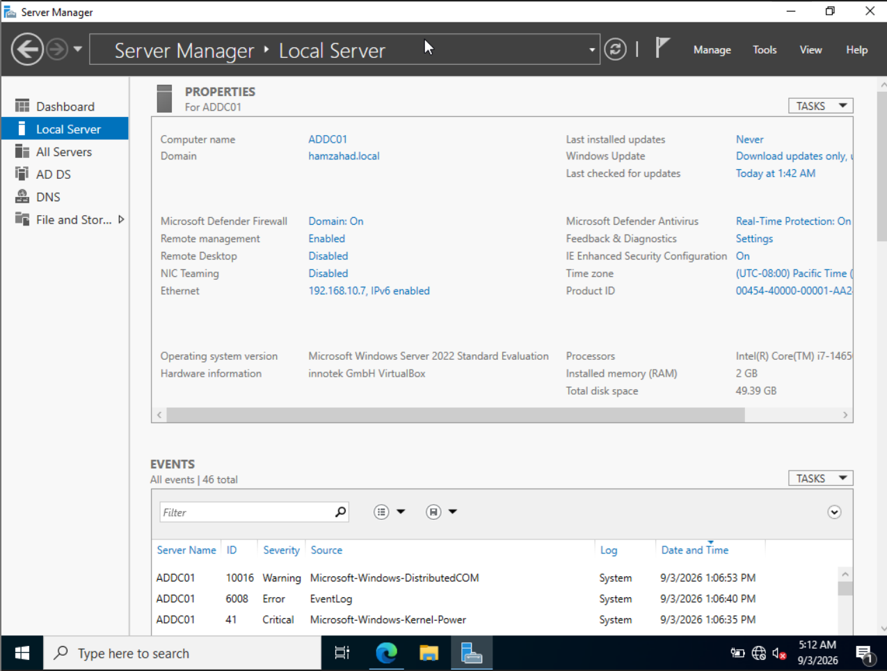

# Active Directory Configuration

## Overview

Active Directory was configured to provide centralised identity and domain management for the Windows environment.

## Domain Controller

A Windows Server 2022 system was configured as the Active Directory Domain Controller.

The Active Directory Domain Services role was installed and configured to establish the lab domain.

## Active Directory Users and Computers

Active Directory Users and Computers was used to manage domain users, groups, computers, and organisational units.

## Users and Groups

User and group accounts were created to simulate a basic enterprise identity environment.

These accounts provided identities that could subsequently generate authentication activity for security monitoring.

## Domain-Joined Endpoint

A Windows endpoint called TARGET-PC was joined to the Active Directory domain.

This allowed authentication and other Windows security activity to be monitored centrally.

## Security Monitoring Relevance

Active Directory generates significant security telemetry, particularly around authentication, account activity, privilege usage, and access to network resources.

Monitoring these events provides useful information for identifying suspicious authentication behaviour and potential account compromise.
