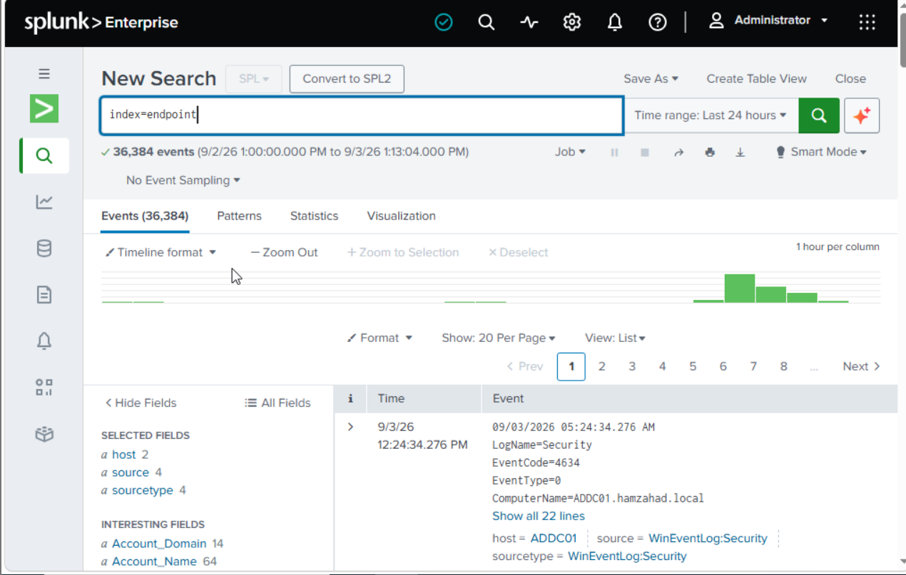
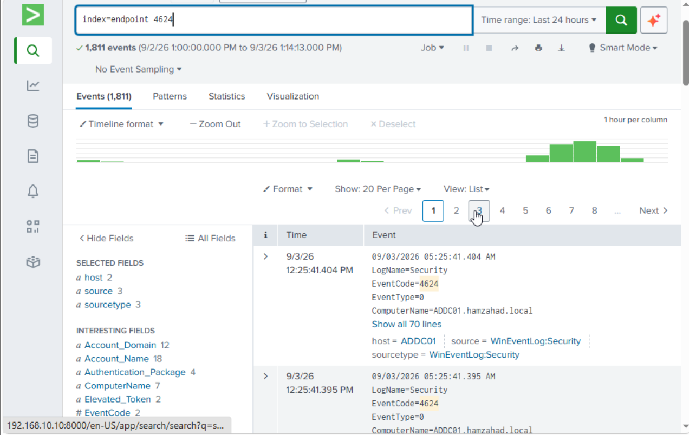

# Splunk SIEM Monitoring

## Overview

Splunk was used as the SIEM platform for collecting, searching, and analysing security telemetry generated by the Windows environment.

The lab focused on authentication monitoring, endpoint telemetry, and investigation of simulated attack activity.

## Log Sources

The environment generated security telemetry from Windows systems, including:

- Windows Security Events
- Sysmon telemetry
- Authentication activity
- Process execution events

## Windows Events in Splunk

Windows security events were searched and analysed through Splunk to investigate authentication and endpoint activity.

## Successful Authentication

Windows Event ID 4624 was used to investigate successful authentication activity.

Relevant information included:

- Account name
- Logon type
- Source information
- Computer
- Timestamp

## Failed Authentication

Windows Event ID 4625 was analysed to identify failed authentication attempts.

Event ID 4625 was particularly relevant during the RDP brute-force simulation because each unsuccessful authentication attempt generated a corresponding failed logon event.

## RDP Brute-Force Investigation

The simulated RDP brute-force activity generated multiple Event ID 4625 events.

These events were investigated in Splunk to determine:

- Which account was targeted
- Which system generated the authentication attempts
- When the attempts occurred
- How frequently the failures occurred
- Whether the activity was consistent with the simulated attack

## Investigation Workflow

The investigation process involved:

1. Searching for relevant Windows events
2. Filtering events by Event ID
3. Reviewing timestamps
4. Identifying affected accounts
5. Reviewing source and destination systems
6. Examining authentication information
7. Correlating repeated events
8. Determining whether the activity was expected or suspicious

## MITRE ATT&CK Context

The RDP brute-force activity was associated with:

- **T1110 – Brute Force**
- **T1110.001 – Password Guessing**
- **T1021.001 – Remote Services: Remote Desktop Protocol**

Windows Event ID 4625 provided the authentication telemetry used to investigate the simulated activity.

## Key Findings

The lab demonstrated how Windows authentication telemetry can be collected and analysed using Splunk.

The RDP brute-force simulation generated observable failed authentication events, allowing the activity to be identified and investigated through a SIEM workflow.
